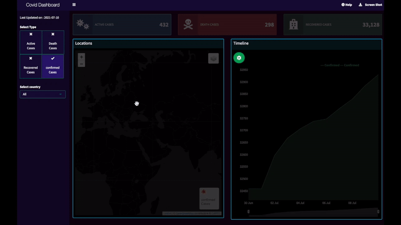

# Shiny Covid Dashboard
#### [Visit the website](http://urlr.app/rcovid)

## Features

- #### View Active Cases

    

- #### View Confirmed Cases

    

- #### View Recovered Cases

    

- #### View Death Cases

    

- #### View Selected Country

    

- #### Change Map Type

    

- #### View Certain Date (Selector)

    

- #### View Certain Date (Slider)

    

- #### View Help

    

- #### Download information

    

- #### Responsive

    